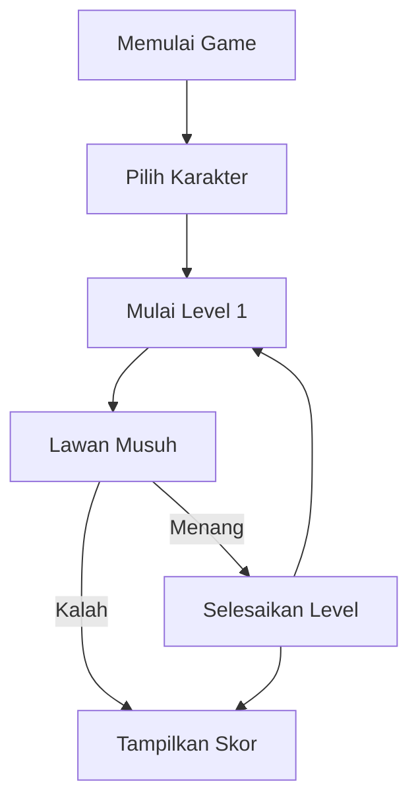

# Pembuatan Game " Kampus Simulator " Menggunakan Bahasa JAVA 
# 1.1 Deskripsi Singkat
Game based Text berjudul "Kampus Simulator" ini menggunakan bahasa pemrograman Java, dimana user akan menjelajahi 
kehidupannya sebagai Mahasiswa di daerah Kampus selama satu hari. 
# 1.2 Algoritma 

# 1.3 Struktur Data
# 1.4 Link Video Penjelasan

